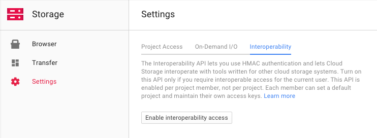

[](http://opensource.org/licenses/MIT)
[](https://packagist.org/packages/flownative/aws-s3)
[](https://www.flownative.com/en/products/open-source.html)

# AWS S3 Adaptor for Neos and Flow

This [Flow](https://flow.neos.io) package allows you to store assets (resources) in [Amazon's S3](https://aws.amazon.com/s3/)
or S3-compatible storages and publish resources to S3 or [Cloudfront](https://aws.amazon.com/cloudfront/). Because
[Neos CMS](https://www.neos.io) is using Flow's resource management under the hood, this adaptor also works nicely for
all kinds of assets in Neos.

## Key Features

- store all assets or only a specific collection in a private S3 bucket
- publish assets to a private or public S3 bucket
- command line interface for basic tasks like connection check or emptying an S3 bucket

Using this connector, you can run a Neos website which does not store any asset (images, PDFs etc.) on your local webserver.

## Installation

The Flownative AWS S3 connector is installed as a regular Flow package via Composer. For your existing project, simply
include `flownative/aws-s3` into the dependencies of your Flow or Neos distribution:

```bash
    $ composer require flownative/aws-s3:2.*
```

## Configuration

In order to communicate with the AWS web service, you need to provide the credentials of an account which has access
to S3 (see next section for instructions for setting up the user in AWS IAM). Add the following configuration to the
`Settings.yaml` for your desired Flow context (for example in `Configuration/Production/Settings.yaml`) and make sure
to replace key, secret and region with your own data:
  
```yaml
Flownative:
  Aws:
    S3:
      profiles:
        default:
          credentials:
            key: 'CD2ADVB134LQ9SFICAJB'
            secret: 'ak1KJAnotasecret9JamNkwYY188872MyljWJ'
          region: 'eu-central-1'
```

You can test your settings by executing the `connect` command. If you restricted access to a particular sub path of
a bucket, you must specify the bucket and key prefix: 

```bash
    $ ./flow s3:connect --bucket test.storage.net --prefix sites/s3-test/
    Access list of objects in bucket "test.storage.neos" with key prefix "sites/s3-test/" ...
    Writing test object into bucket (arn:aws:s3:::test.storage.neos/sites/s3-test/Flownative.Aws.S3.ConnectionTest.txt) ...
    Deleting test object from bucket ...
    OK    
```

Note that it does make a difference if you specify the prefix with a leading slash "/" or without, because the corresponding
policy must match the pattern correctly, as you can see in the next section.

Right now, you can only define one connection profile, namely the "default" profile. Additional profiles may be supported
in future versions.

## IAM Setup

It is best practice to create a user through AWS' Identity and Access Management which is exclusively used for your
Flow or Neos instance to communicate with S3. This user needs minimal access rights, which can be defined either by
an inline policy or through membership at a group which has the respective policy applied.

The following inline policy provides the necessary rights to the user to execute all necessary operations for asset
management in Neos. It is designed to share one bucket with multiple sites / users and only grants access to a specific
sub path within your bucket. By using using the username as a path segment through a [policy variable](http://docs.aws.amazon.com/IAM/latest/UserGuide/reference_policies_variables.html),
this policy can be reused across multiple users (for example by providing it in a IAM Group).

For more detail on the rights used in the policy, Amazon provides detailed information about [how S3 authorizes a request
for a bucket operation](http://docs.aws.amazon.com/AmazonS3/latest/dev/access-control-auth-workflow-bucket-operation.html).

```json
{
    "Version": "2012-10-17",
    "Statement": [
        {
            "Effect": "Allow",
            "Action": [
                "s3:GetBucketLocation"
            ],
            "Resource": "arn:aws:s3:::*"
        },
        {
            "Effect": "Allow",
            "Action": [
                "s3:ListBucket"
            ],
            "Resource": [
                "arn:aws:s3:::test.storage.neos",
                "arn:aws:s3:::test.target.neos"
            ],
            "Condition": {
                "StringLike": {
                    "s3:prefix": [
                        "",
                        "sites/",
                        "sites/${aws:username}/"
                    ]
                }
            }
        },
        {
            "Effect": "Allow",
            "Action": [
                "s3:GetObject",
                "s3:GetObjectExtended",
                "s3:GetObjectTorrent",
                "s3:PutObject",
                "s3:PutObjectInline",
                "s3:DeleteObject",
                "s3:AbortMultipartUpload",
                "s3:ListMultipartUploadParts",
                "s3:GetObjectAcl",
                "s3:PutObjectAcl"
            ],
            "Resource": [
                "arn:aws:s3:::test.storage.neos/*",
                "arn:aws:s3:::test.target.neos/*"
            ]
        }
    ]
}
```

## Publish Assets to S3 / Cloudfront

Once the connector package is in place, you add a new publishing target which uses that connect and assign this target
to your collection.

```yaml

  Neos:
    Flow:
      resource:
        collections:
          persistent:
            target: 'cloudFrontPersistentResourcesTarget'
        targets:
          cloudFrontPersistentResourcesTarget:
            target: 'Flownative\Aws\S3\S3Target'
            targetOptions:
              bucket: 'target.neos.example.com'
              keyPrefix: '/'
              baseUri: 'https://abc123def456.cloudfront.net/'
```

Since the new publishing target will be empty initially, you need to publish your assets to the new target by using the
``resource:publish`` command:

```bash
    path$ ./flow resource:publish
```

This command will upload your files to the target and use the calculated remote URL for all your assets from now on.

## Switching the Storage of a Collection

If you want to migrate from your default local filesystem storage to a remote storage, you need to copy all your existing
persistent resources to that new storage and use that storage afterwards by default.

You start by adding a new storage with the S3 connector to your configuration. As you might want also want to serve your
assets by the remote storage system, you also add a target that contains your published resources.

```yaml

  Neos:
    Flow:
      resource:
        storages:
          s3PersistentResourcesStorage:
            storage: 'Flownative\Aws\S3\S3Storage'
            storageOptions:
              bucket: 'storage.neos.example.com'
              keyPrefix: 'sites/wwwexamplecom/'
        targets:
          s3PersistentResourcesTarget:
            target: 'Flownative\Aws\S3\S3Target'
            targetOptions:
              bucket: 'target.neos.example.com'
              keyPrefix: 'sites/wwwexamplecom/'
              baseUri: 'https://abc123def456.cloudfront.net/'
```

Some notes regarding the configuration:

You must create separate buckets for storage and target respectively, because the storage will remain private and the
target will potentially be published. Even if it might work using one bucket for both, this is a non-supported setup.

The `keyPrefix` option allows you to share one bucket accross multiple websites or applications. All S3 objects keys
will be prefiexd by the given string.

The `baseUri` option defines the root of the publicly accessible address pointing to your published resources. In the
example above, baseUri points to a Cloudfront subdomain which needs to be set up separately. It is rarely a good idea to
the public URI of S3 objects directly (like, for example "https://s3.eu-central-1.amazonaws.com/target.neos.example.com/sites/wwwexamplecom/00889c4636cd77876e154796d469955e567ce23c/NeosCMS-2507x3347.jpg") because S3 is usually too slow for being used as a server for common assets on your website. It's good for downloads, but not for your CSS files or photos.

In order to copy the resources to the new storage we need a temporary collection that uses the storage and the new
publication target.

```yaml

  Neos:
    Flow:
      resource:
        collections:
          tmpNewCollection:
            storage: 's3PersistentResourcesStorage'
            target: 's3PersistentResourcesTarget'
```

Now you can use the ``resource:copy`` command (available in Flow 3.1 or Neos 2.1 and higher):

```bash

    $ ./flow resource:copy --publish persistent tmpNewCollection

```

This will copy all your files from your current storage (local filesystem) to the new remote storage. The ``--publish``
flag means that this command also publishes all the resources to the new target, and you have the same state on your
current storage and publication target as on the new one.

Now you can overwrite your old collection configuration and remove the temporary one:

```yaml

  Neos:
    Flow:
      resource:
        collections:
          persistent:
            storage: 's3PersistentResourcesStorage'
            target: 's3PersistentResourcesTarget'
```

Clear caches and you're done.

```bash

    $ ./flow flow:cache:flush

```

## Full Example Configuration for S3

```yaml
Neos:
  Flow:

    resource:
      storages:
        s3PersistentResourcesStorage:
          storage: 'Flownative\Aws\S3\S3Storage'
          storageOptions:
            bucket: 'storage.neos.prd.fra.flownative.net'
            keyPrefix: 'flownative/wwwneosio/'

      collections:

      # Collection which contains all persistent resources
        persistent:
          storage: 's3PersistentResourcesStorage'
          target: 's3PersistentResourcesTarget'

      targets:
        localWebDirectoryPersistentResourcesTarget:
          target: 'Neos\Flow\ResourceManagement\Target\FileSystemTarget'
          targetOptions:
            path: '%FLOW_PATH_WEB%_Resources/Persistent/'
            baseUri: '_Resources/Persistent/'
            subdivideHashPathSegment: false

        s3PersistentResourcesTarget:
          target: 'Flownative\Aws\S3\S3Target'
          targetOptions:
            bucket: 'target.neos.prd.fra.flownative.net'
            keyPrefix: 'flownative/wwwneosio/'
            baseUri: 'https://12345abcde6789.cloudfront.net/'

Flownative:
  Aws:
    S3:
      profiles:
        default:
          signature: 'v4'
          credentials:
            key: 'QD2AD2B134LQ9SF1CAJB'
            secret: 'ak1KJAnotasecret9JamNkwYY188872MyljWJ'
          region: 'eu-central-1'
```

## Using Google Cloud Storage

Google Cloud Storage (GCS) is an offering by Google which is very similar to AWS S3. In fact, GCS supports an S3-compatible
endpoint which allows you to use Google's storage as a replacement for Amazon's S3. However, note that if you
access GCS through the S3 compatible service endpoint, you won't be able to use the full feature set of Google Cloud
Storage and you cannot easily restrict access for different users to specific buckets or sub paths. 

GCS does not have a limit for the number of buckets you can have for one account, therefore you don't necessarily need
to share buckets across sites or projects. The following instructions assume that you use one dedicated bucket for
your Neos or Flow project.

To enable S3 support, go to your Google Cloud Storage console and enable interoperability in the Settings panel. Once
this mode is enabled, you can create one or more access keys which you can use for accessing GCS through the S3
endpoint.



You can then use the generated key and secret in the settings of the S3 connector. Additionally to the usual credentials,
you need to specify a custom endpoint which refers to Google's S3 compatibility service.

```yaml
Flownative:
  Aws:
    S3:
      profiles:
        # Default credentials and client options
        # Override these in your settings with real values
        default:
          credentials:
            key: 'GOOGABCDEFG123456789'
            secret: 'abcdefgHIJKLMNOP1234567890QRSTUVWXYZabcd'
          endpoint: 'https://storage.googleapis.com/mybucket.flownative.net'
```

## Using MinIO

[MinIO](https://min.io/) is a S3 compatible cloud storage server.
You can also use it to store your assets.

You can then use your key and secret in the settings of the S3 connector.
Additionally you need to specify a custom endpoint which refers to your MinIO instance.   
AWS S3 is going to prepend the bucket name to your custom endpoints hostname by default.
Activating the `use_path_style_endpoint` option, the bucket name gets appended to the custom endpoint.
Please do not miss the minio flag, otherwise you may encounter errors with resources stored beneath other resources.  
 
```yaml
Flownative:
  Aws:
    S3:
      profiles:
        # Default credentials and client options
        # Override these in your settings with real values
        default:
          credentials:
            key: 'QD2AD2B134LQ9SF1CAJB'
            secret: 'ak1KJAnotasecret9JamNkwYY188872MyljWJ'
          endpoint: 'http://your-minio.com:9000/'
          # Prevents the aws client to prepend the bucket name to the hostname
          # e.g. http://bucket.your-minio.com:9000/:
          use_path_style_endpoint: true
          minio: true
```